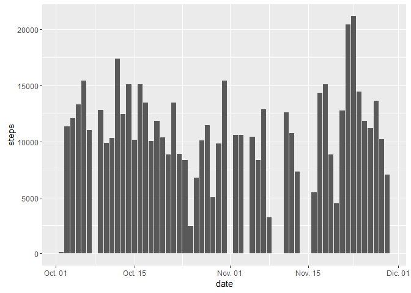
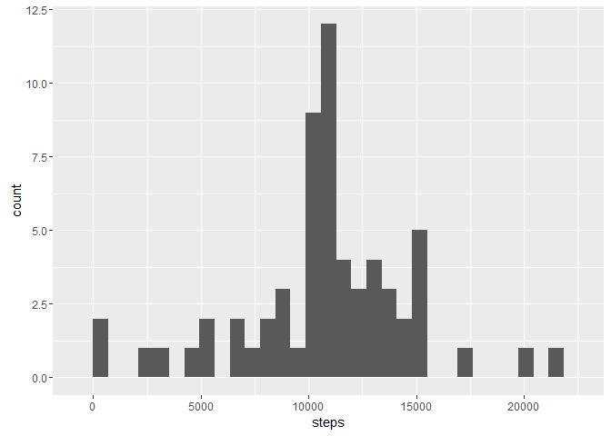
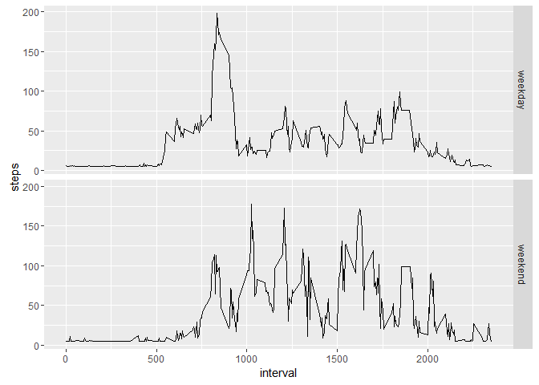

# Reproducible Research: Peer Assessment 1

## Loading libraries 

```r
library(dplyr)
```

```
## 
## Attaching package: 'dplyr'
```

```
## The following objects are masked from 'package:stats':
## 
##     filter, lag
```

```
## The following objects are masked from 'package:base':
## 
##     intersect, setdiff, setequal, union
```

```r
library(ggplot2)
```

## Loading and preprocessing the data

```r
urlData <- "https://d396qusza40orc.cloudfront.net/repdata%2Fdata%2Factivity.zip"
zipData <- "activity.zip"

fileData <- "activity.csv"
dateFormat <- "%Y-%m-%d"

weekenddays <- c("sáb", "dom.") #Spanish shortnames for saturday and sunday

if (!file.exists(fileData)) { 
  if (!file.exists(zipData)){
    download.file(urlData, zipData)
  }
  unzip(zipData)
}

setAs("character","sdate", function(from) as.Date(from, format=dateFormat) )
```

```
## in method for 'coerce' with signature '"character","sdate"': no definition for class "sdate"
```

```r
activity <- read.csv(fileData, colClasses = c("numeric", "sdate", "numeric"))
```
## What is mean total number of steps taken per day?

```r
activityperday <- activity %>% na.omit() %>% group_by(date) %>% summarise(steps = sum(steps))
ggplot(activityperday, aes(x = steps)) + geom_histogram()
```

```
## `stat_bin()` using `bins = 30`. Pick better value with `binwidth`.
```



```r
ggplot(activityperday, aes(x = date, y = steps)) + geom_bar(stat = "identity")
```


```r
mean(activityperday$steps)
```

```
## [1] 10766.19
```

```r
median(activityperday$steps)
```

```
## [1] 10765
```

## What is the average daily activity pattern?

```r
activityperinterval <- activity %>% na.omit() %>% group_by(interval) %>% summarise(steps = mean(steps))
ggplot(activityperinterval, aes(x=interval, y=steps)) + geom_line()
```


```r
maxsteps <- max(activityperinterval$steps)
activityperinterval[activityperinterval$steps == maxsteps,]
```

```
## Source: local data frame [1 x 2]
## 
##   interval    steps
##      (dbl)    (dbl)
## 1      835 206.1698
```


## Imputing missing values

```r
sum(is.na(activity$steps))
```

```
## [1] 2304
```

```r
stepsintervalmean <- mean(activity$steps, na.rm = TRUE)

activitywona <- activity
activitywona[is.na(activitywona$steps),]$steps <- stepsintervalmean

activitywonaperday <- activitywona %>% na.omit() %>% group_by(date) %>% summarise(steps = sum(steps))

ggplot(activitywonaperday, aes(x = steps)) + geom_histogram()
```

```
## `stat_bin()` using `bins = 30`. Pick better value with `binwidth`.
```



```r
mean(activitywonaperday$steps)
```

```
## [1] 10766.19
```

```r
median(activitywonaperday$steps)
```

```
## [1] 10766.19
```
Do these values differ from the estimates from the first part of the assignment? What is the impact of imputing missing data on the estimates of the total daily number of steps?


## Are there differences in activity patterns between weekdays and weekends?

```r
activitywona$typeday <- NA
activitywona[weekdays(activitywona$date, abbreviate =TRUE) %in% weekenddays,]$typeday <- "weekend"

activitywona[is.na(activitywona$typeday),]$typeday <- "weekday"

activitywonaperinterval <- activitywona %>% group_by(typeday,interval) %>% summarise(steps = mean(steps))
ggplot(activitywonaperinterval, aes(x=interval, y=steps)) + geom_line() + facet_grid(typeday~.)
```



